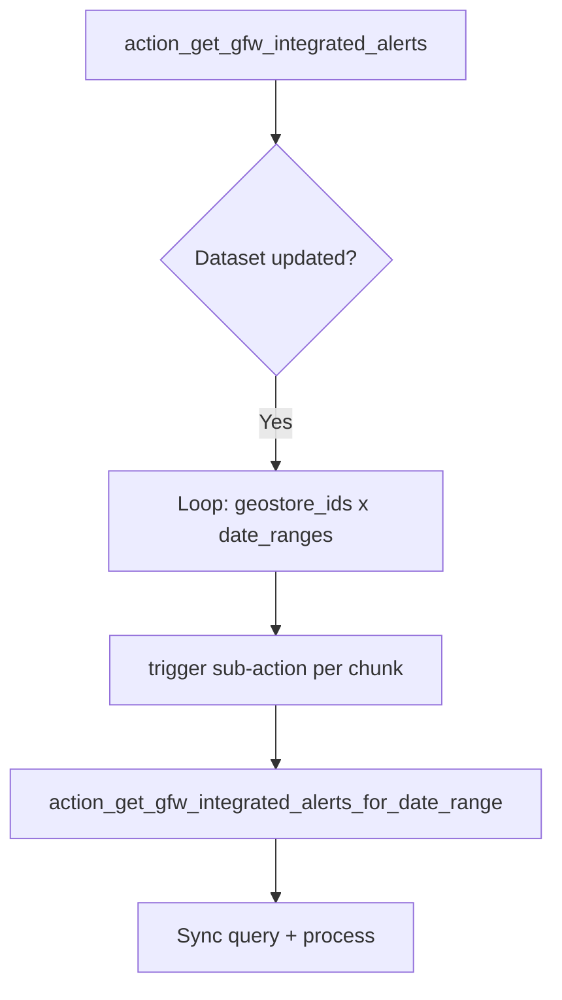
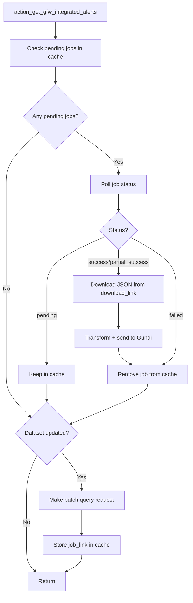

# Batch Query for Integrated Alerts

## Overview

Replace the current approach of triggering multiple date-range sub-actions with a single batch query request that returns a job ID. On subsequent runs, poll pending jobs and download results when ready.

## Current Flow

## New Flow

## Changes

### 1. Add Job Status and Download Methods to DataAPI

In [app/actions/gfwclient.py](app/actions/gfwclient.py):

- Add `get_job_status(job_link: str) -> JobResponse.Data` method to poll a job's status
- Add `download_job_results(download_link: str) -> List[dict]` method to fetch JSON results

### 2. Add Job Cache Methods to IntegrationStateManager

In [app/services/state.py](app/services/state.py):

- Add `add_pending_job(integration_id, action_id, job_data: dict)` - store job_link and metadata
- Add `get_pending_jobs(integration_id, action_id) -> List[dict]` - retrieve all pending jobs
- Add `remove_pending_job(integration_id, action_id, job_id)` - remove completed/failed job

Use Redis list or set with key pattern: `integration_state.{integration_id}.{action_id}.pending_jobs`

### 3. Refactor action_get_gfw_integrated_alerts

In [app/actions/handlers.py](app/actions/handlers.py) (lines 341-431):

**Step 1: Poll existing jobs**

- Get pending jobs from cache
- For each job, call `get_job_status()`
- If `status` is `"success"` or `"partial_success"`:
  - Download data via `download_job_results(download_link)`
  - Transform alerts using existing `transform_integrated_alert()`
  - Send to Gundi via `handle_transformed_data()`
  - Log warning if `partial_success` and `failed_geometries_link` exists
  - Remove job from cache
- If `status` is `"failed"`: log error, remove from cache
- If `status` is `"pending"`: keep in cache for next run

**Step 2: Create new batch query if dataset updated**

- Use single date range covering full lookback period (no date chunking)
- Call `query_batch_gfw_integrated_alerts()` with the geostore_id
- Parse response as `JobResponse`
- Store job data in cache

### 4. Remove or Deprecate Sub-Action

The `action_get_gfw_integrated_alerts_for_date_range` function (lines 479-517) will no longer be triggered from `action_get_gfw_integrated_alerts`. Consider keeping it for backwards compatibility or removing if unused elsewhere.