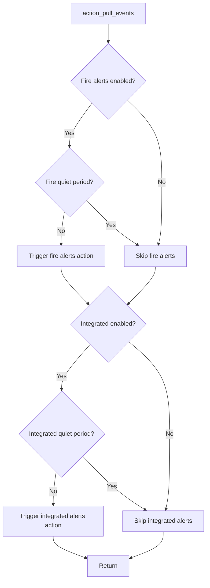
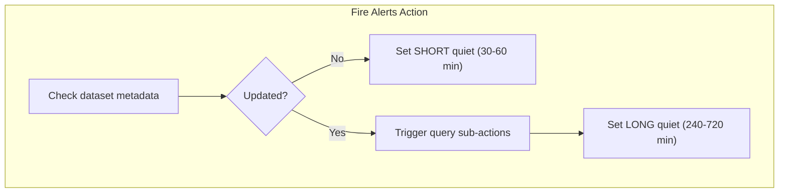
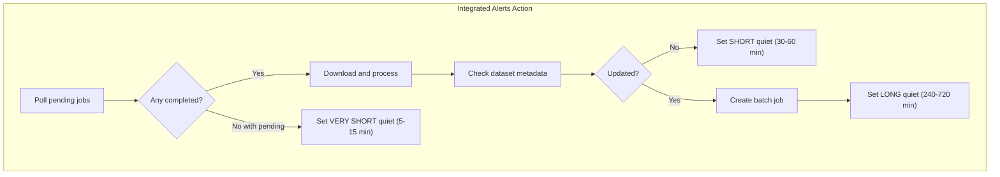

# Per-Feed Tiered Quiet Periods

## Current Issues

1. Single global quiet period blocks both feeds together
2. Same long quiet period (4-12 hours) regardless of whether work was done
3. Metadata checks are cheap but get blocked alongside expensive queries
4. No differentiation between "polling pending jobs" vs "created new job" vs "no updates"

## Tiered Quiet Period Strategy

| Outcome | Quiet Period | Rationale |

|---------|--------------|-----------|

| Dataset not updated | 30-60 min | Cheap metadata check, poll frequently |

| Dataset updated, work triggered | 240-720 min | Rate limit expensive queries |

| **Integrated alerts specific:** | | |

| Jobs still pending | 5-15 min | Poll job status frequently |

| Jobs completed, data processed | 240-720 min | Work done, wait before next batch |

## New Flow





## Changes

### 1. [app/actions/handlers.py](app/actions/handlers.py) - `action_pull_events`

**Remove global quiet period check (line ~117) and set (line ~222). Add per-feed quiet period checks:**

```python
# Fire alerts - check its own quiet period
if action_config.include_fire_alerts:
    if not action_config.force_fetch and await state_manager.is_quiet_period(
        str(integration.id), "fire_alerts"
    ):
        logger.info("Fire alerts quiet period active, skipping")
    else:
        fire_config = GetFireAlertsDatasetAndGeostoresConfig(...)
        await trigger_action(integration.id, "get_nasa_viirs_fire_alerts", config=fire_config)
        triggered_actions.append("fire_alerts")

# Integrated alerts - check its own quiet period  
if action_config.include_integrated_alerts:
    if not action_config.force_fetch and await state_manager.is_quiet_period(
        str(integration.id), "integrated_alerts"
    ):
        logger.info("Integrated alerts quiet period active, skipping")
    else:
        integrated_config = GetIntegratedAlertsDatasetAndGeostoresConfig(...)
        await trigger_action(integration.id, "get_gfw_integrated_alerts", config=integrated_config)
        triggered_actions.append("integrated_alerts")
```

### 2. [app/actions/handlers.py](app/actions/handlers.py) - `action_get_nasa_viirs_fire_alerts`

**Add quiet period set at end based on outcome:**

```python
# At the end of the function, before return:
if fire_alerts_actions_triggered > 0:
    # Work was done - long quiet period
    quiet_minutes = random.randint(240, 720)
else:
    # No updates - short quiet period for frequent checks
    quiet_minutes = random.randint(30, 60)

await state_manager.set_quiet_period(
    str(integration.id), "fire_alerts", timedelta(minutes=quiet_minutes)
)
```

### 3. [app/actions/handlers.py](app/actions/handlers.py) - `action_get_gfw_integrated_alerts`

**Add quiet period set at end based on outcome:**

```python
# At the end of the function, before return:
if result["jobs_pending"] > 0:
    # Jobs still processing - very short quiet period to poll frequently
    quiet_minutes = random.randint(5, 15)
elif result["batch_jobs_created"] > 0 or result["jobs_completed"] > 0:
    # Work was done - long quiet period
    quiet_minutes = random.randint(240, 720)
else:
    # No updates, no pending jobs - short quiet period
    quiet_minutes = random.randint(30, 60)

await state_manager.set_quiet_period(
    str(integration.id), "integrated_alerts", timedelta(minutes=quiet_minutes)
)
```

## Benefits

- Frequent metadata checks when nothing is happening (cheap operation)
- Rate-limited queries when dataset updates are detected (expensive operation)
- Fast polling of pending batch jobs for integrated alerts
- Independent schedules for each feed based on their own update patterns
- Maintains random jitter to prevent stampeding herd